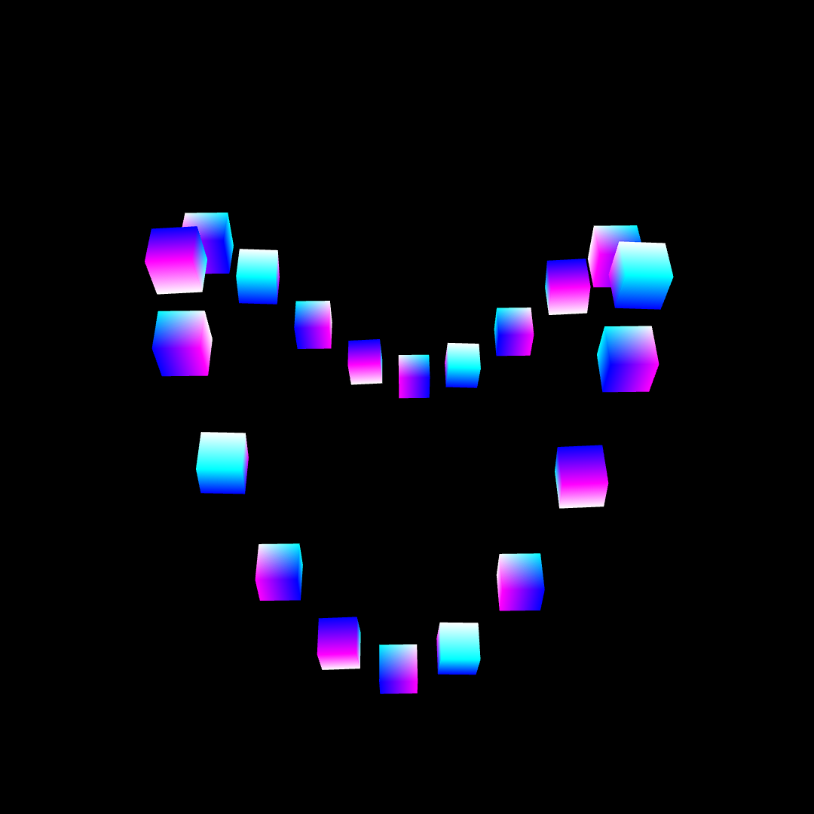
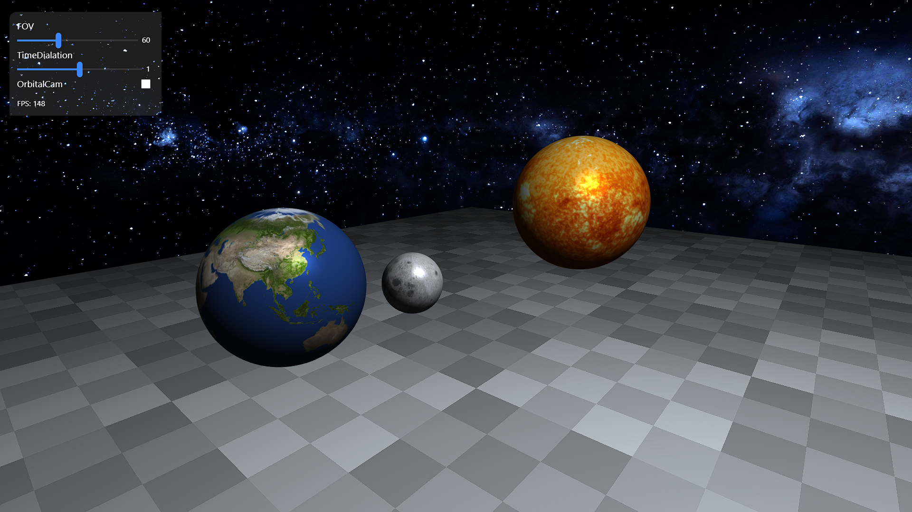
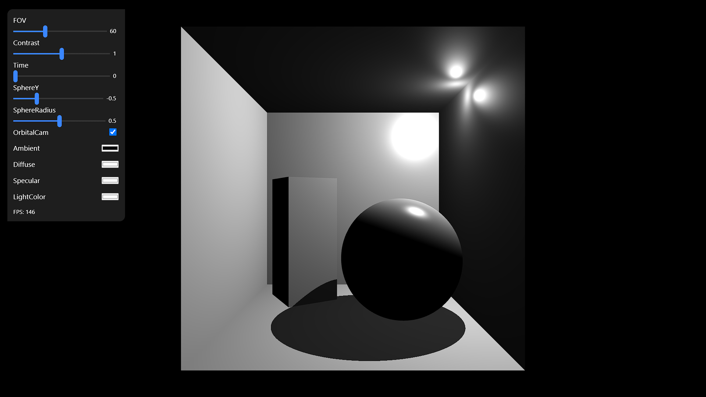

# WebGL-Basics-JS
My implementation of basic WebGL techniques using vanilla **JavaScrpit**. No **NodeJS** and no **additional libraries**.

## How to run
1. Clone the repository
2. Open the `index.html` file in your browser
    Change the `src` attribute of the `script` tag to run a different example
    Options are:
    - `src="scenes/cubes.js"`
    - `src="scenes/planets.js"`
    - `src="scenes/cornellBox.js"`
3. Enjoy!

## Examples
### Cubes

Simple scene with cubes. The cubes are rotating around their own axis. The camera enabled with orbit controls around the Y axis. The cubes are shaded with UV coordinates.

### Planets

Simple scene Earth and Sun and moon (not to scale). The camera has both orbit and FPV controls. The planets are shaded with 8K textures and Phong shading(no shadows). Textures are from [Solar System Scope](https://www.solarsystemscope.com/textures/). Also the sun does not emit light, yet :), it is rather lit by a point light.

### Cornell Box

Legendary Cornell Box. Currenlty under implementation. A simple approach to shadows is used.

## UI
I copied code from [Range Slider Progress in Chrome with pure CSS 🌟](https://codepen.io/ShadowShahriar/pen/zYPPYrQ) for simple sliders. I modified the code to fit my needs. The code is in `src/assets/modules/ui.js`.

## Shaders
All shaders are in `src/shaders/`. All shaders are written in GLSL ES 3.0. The shaders are compiled at runtime. The shaders are loaded in the `src/assets/modules/shader.js` module.
- `src/shaders/cameraSpaceNormal.*` - Vertex/Fragment shader for normal mapping in camera space
- `src/shaders/cornell.*` - Vertex/Fragment shader for Cornell Box, with shadows
- `src/shaders/depth.*` - Vertex/Fragment shader for depth mapping
- `src/shaders/modelUV.*` - Vertex/Fragment shader for UV mapping
- `src/shaders/phong.*` - Vertex/Fragment shader for UV mapping with Phong shading, no shadows
- `src/shaders/wavy.*` - Vertex/Fragment shader with perlin noise normal displacement
- `src/shaders/worldSpaceNormals.*` - Vertex/Fragment shader for normal mapping in world space

## Resources
- [WebGL Fundamentals](https://webglfundamentals.org/)
- [WebGL2 Fundamentals](https://webgl2fundamentals.org/)
- [OpenGL - State Machine Visualization](https://webglfundamentals.org/webgl/lessons/resources/webgl-state-diagram.html)
- [LearnOpenGL - Joey de Vries](https://learnopengl.com/)
- [Solar System Scope](https://www.solarsystemscope.com/textures/)
- [Cornell Box](https://en.wikipedia.org/wiki/Cornell_box)

## License
[MIT License](https://choosealicense.com/licenses/mit/)